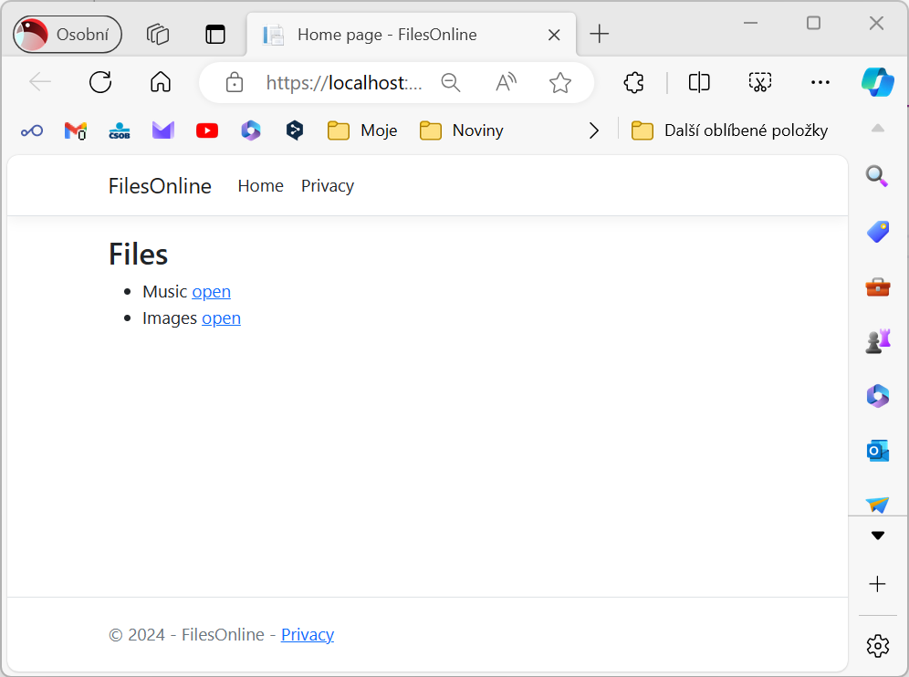
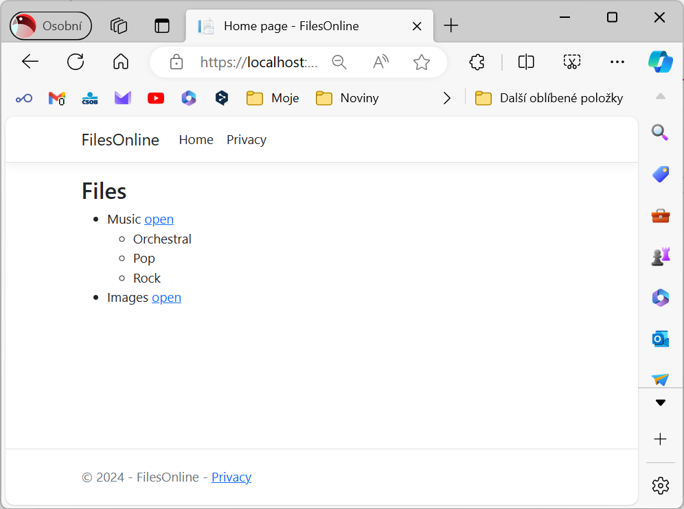
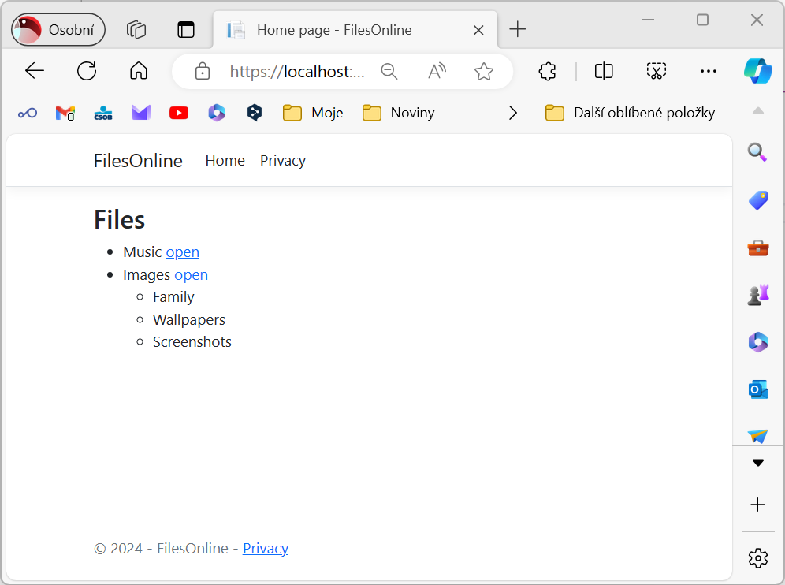
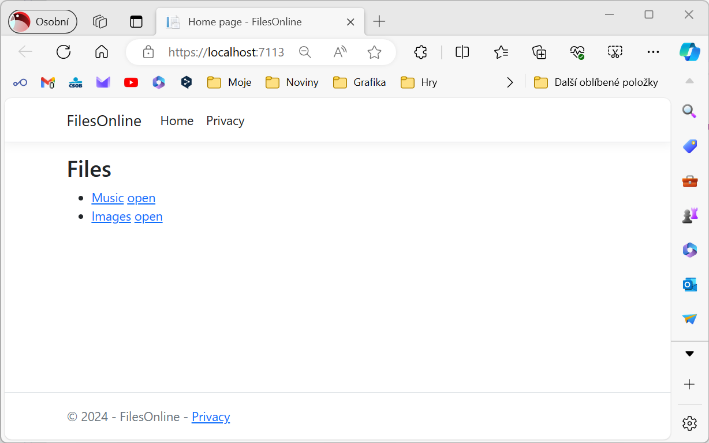
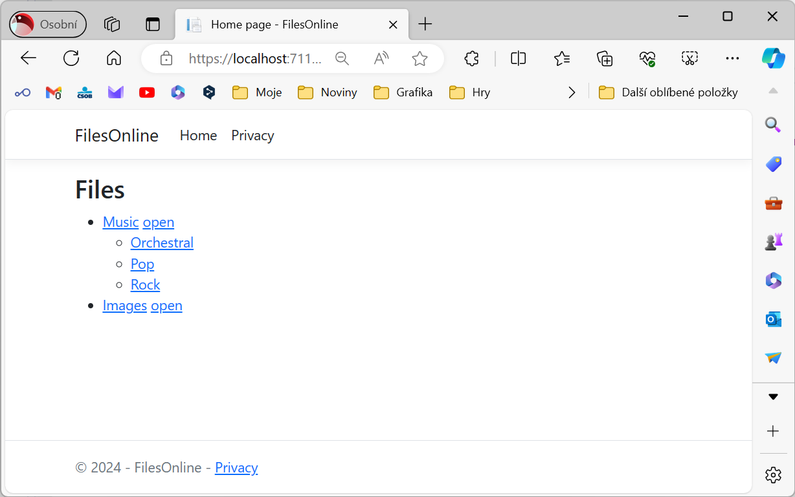
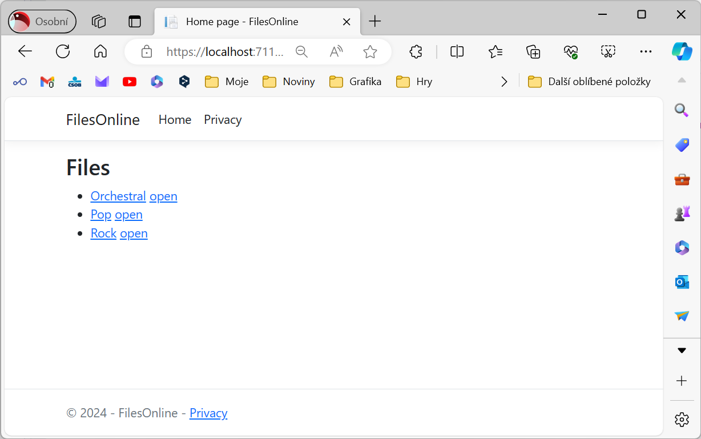

# FilesOnline

Navrhnìte a vytvoøte datovou strukturu pro ukládání informací o složkách uložených do stromové struktury - to znamená, že každá složka mùže obsahovat další složky.
Složka mùže mít pøesnì jednoho rodièe. Pak vytvoøte aplikaci, která umožní touto strukturou procházet a zobrazovat seznam podsložek.

## Zadání

1. Vytvoøte datovou strukturu pro ukládání informací o složkách uložených do stromové struktury. Jediná datová položka je název složky. Jak se odkážete na podložky a rodièe této složky je na Vás. Klíèem k záznamu o složce by mìlo být vygenerované Guid.					
1. Zkonfigurujte Entity Framework tak, aby pracoval s databází SQLite (*files.sqlite*)
1. Pøeneste navrženou strukturu do databáze
1. Naseedujte do databáze nìkolik záznamù - ideálnì ve tøech úrovních
1. Data vložte do databáze - tzv. seedování
1. Modifikujte stránku index.cshtml tak, aby se dokázala pøipojit k databázi
1. Na stránce zobrazte seznam složek (koøenových)
1. Pøidejte možnost "rozbalit" obsah složky (podsložky) tak, aby došlo k naètení jen dat z této podsložky - použijte tedy explicit loading
1. (Rozšíøení zadání) Pøidejte požnost procházet strukturou smìrem k podsložkám pøes odkazy

## Screenshoty

### Základ

### Rozšíøení

## Nápovìda

Vygenerování klíèe Guid

    FolderId = Guid.NewGuid()

